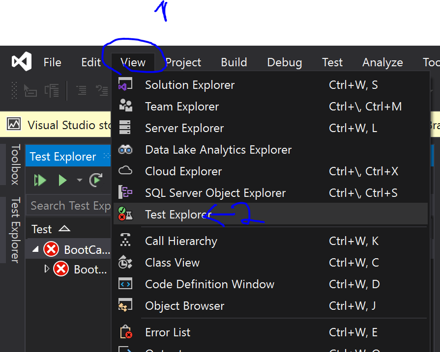
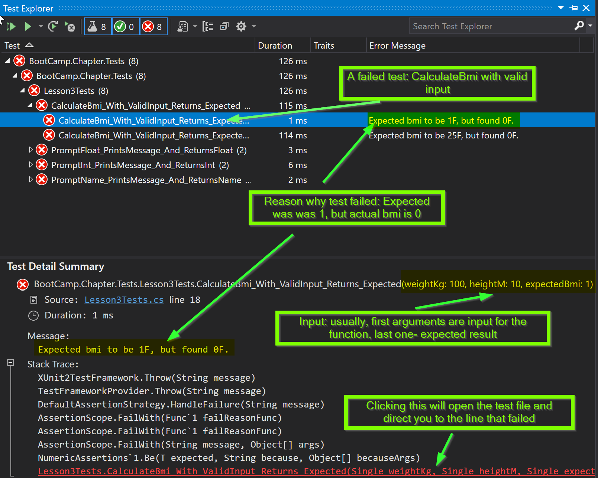

# C#: From Zero To Hero

## Chapter 1. Homework 3: Functions

### Intro

#### Functions

Variables and functions is what makes every single program.
Code is a story that we, developers write.
We start story from high level functions (title) and the more in depth we go, 
the lower such detailed code (content) ends up.

Every function has 5 things:
- access modifier (private, protected, internal, public)
- return type (void if it does not return anything, otherwise all the types are the same as you would declare variables)
- name
- arguments (can be 0 or more)
- body (what the function does)

For example:

```
public void Foo(int n)
{
  Console.WriteLine(n);
}
```

or

```
public static int Bar()
{
  return 0;
}
```

Note that some functions can also have a static modifier (in fact, all function in the homework of chapter 1). Those functions are global and don't require objects to be called. But this is only for the beginning. Normally, we avoid static functions because we want to make them localized to an object. About that more in chapter 2.

#### Tests

How do we know if code works?
How do we define exactly what the code needs to do, under what conditions?
How do we know when the code should succeed and when should it fail?  
It's all  done through unit tests. 
For now, you won't have to write tests, but you will have to pass them to see if your code works.
So pay attention to what tests are red and fix them.

##### Unit tests

Unit tests, as the name implies, tests one thing only!
The benefit of unit tests is that if we know that everything has been tested,
just by clicking one button we can check the overall health of our codebase.
Another benefit of unit tests is that in theory, you should not need to even debug.
All tests are testing one small thing, therefore if a test fails, you should know exactly where the problem is.

###### Black box testing

Black box is a kind of testing when we don't really care how things work internally.
All we care about is the input passed and the results returned.
Therefore, all that matters in such tests is input/output pairs.

###### White box testing

White box testing also verifies if key parts of system were interacted with.
In the homework of chapters 1-3 we will not use such kind of tests.
More about them in chapter 4 (TDD).

##### Reading test results

1) Open the Test Explorer: from top menu bar: View->Test Explorer.
   
2) Click "run all tests" button (left-most)
3) Expand test results until you cannot (the most detailed test case reached)
4) Open the expanded test case
5) If the test case failed, it will show up as X and in Test Case Summary have all the information needed to fix it.

##### How to read test failures?

The great thing about test explorer and the summary window is that you can see all the details you need in order to determine what went wrong and where to look to fix it.
Here is an illustration of a specific test failing



So you know that the test and why it failed and now we should fix it (make it green).
Click on the red text that indicates the line of code that did not meet the criteria.
It will open the file of tests that failed at the line that had input which did not meet the criteria.
Stepping into the function that you were reidirected to will reveal the actual reason behind the failing tests.

### Task

#### Code

1) Fork https://github.com/csinn/CSharp-From-Zero-To-Hero/tree/Chapter1/Homework/3
2) Take homework 2 code, place it in the forked branch and refactor it using functions. There should be as little duplicate code as possible (there should be functions for:
- Calculating BMI (weight comes in kg, height comes in meters),
- Prompt for input and converting it to int (print message for request, read console input and return converted input to int), 
- Prompt for input and converting it to string (print message for request, read console input and return input),
- Prompt for input and converting it to float (print message for request, read console input and return converted input to float).
3) Put all the function you made into the right places in Checks.cs class. Run tests, make sure you pass all the tests
4) Put all program.cs logic to Lesson3.cs. Call it from main function. Program class should look like this:

```
public class Program
{
  static void Main(string[] args)
  {
    Lesson3.Demo();
  }
} 
```

#### Guide

1) Open the Homework 3:
  * Choose the Chapter1/Homework/3 branch in the bottom right.
    * If it is not there already:
      * Click manage branches.
      * Open remotes/origin/Chapter1/Homework and rightclick 3 and choose fetch.
      * There should be a "Chapter1/Homework/3" path be available now. Choose that one.
    * If it was there already you should sync as in the hint above.
  * Open the solution explorer and Bootcamp.sln (if not already open).
2) Take homework 2 code, place it in the Program.cs file of the current solution and make sure it still compiles and runs.
3) Create a file Lesson3.cs:
  * Rightclick BootCamp.Chapter.
  * Click add.
  * Click class.
  * Type in Lesson3 and hit enter. (You can omit the .cs, it will be put there anyway.)
4) Write a public static void Demo() function in this file.
5) Put all Program.cs logic to Lesson3.cs. Call it from Main function.
  * Do not delete the function or it's curly braces.
  * Write between the curly braces "Lesson3.Demo();" without the ".
  * This should look like this:
  
  ```csharp
    public class Program
    {
        static void Main(string[] args)
        {
            Lesson3.Demo();
        }
    }
  ```
  
6) Refactor/edit Lesson3.Demo() by using functions.
  * There should be as little duplicate code as possible
  * There should be functions for:
    * Calculating BMI (weight comes in kg, height comes in meters),
    * Prompt for input and converting it to int (print message for request, read console input and return converted input to int), 
    * Prompt for input and converting it to string (print message for request, read console input and return input),
    * Prompt for input and converting it to float (print message for request, read console input and return converted input to float).
7) Call "Lesson3.X(y)" functions from the Checks.cs file.
  * X is the name of your function.
  * y are the parameters of your function. If you do not have parameters then there is no y.
8) Run tests, make sure you pass all the tests.
  * Open the Tests folder of the solution.
  * Rightclick BootCamp.Chapter.Tests.
  * Choose execute tests.
  * Green indicates positive tests, red negative ones.
    * If a test is red, click it.
    * Read the error message.
      * The first information that you get is what was expected.
      * The second information is what was received.
      * Your task is to setup the functionality in the Lesson3.cs file correctly.
        * Input comes from the tests and gets passed as argument to the Checks.cs functions.
        * The Checks.cs functions should only include a "return Lesson3.X(y);" and execute no other code than that.
        * Your Lesson3.cs functions should return the right output for the transmitted input. Otherwise a test will fail!

### Hints

* This will make homework 4 much more easy:
  * Do use Environment.NewLine if you want to concanate a string with a newline command (or use WriteLine).
  * Do use [CultureInfo.InvariantCulture](https://docs.microsoft.com/de-de/dotnet/api/system.globalization.cultureinfo.invariantculture?view=netcore-3.1) when reading in float numbers. (Due to differences in parsing numbers with '.' and ',' character.
* The better your design, the easier it will be to find and fix errors!
* Sometimes you have to sync new changes from the C# Inn repository:
  * Click the pencil symbol at the bottom right.
  * Commit your changes or stash them (after finishing homework 2 there should none be left).
  * Choose the correct branch in the bottom right (in this case Chapter1/Homework/3 should already be selected).
  * Click the house button straight above (upper end).
  * Click the sync button.
  * Click fetch.
  * Click pull.
