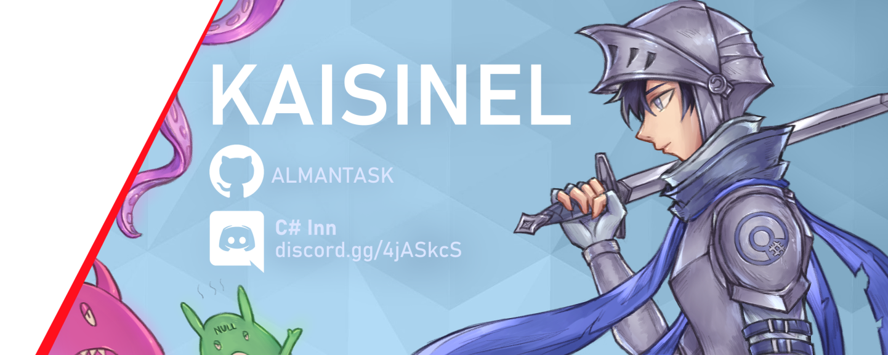

# C#: From Zero To Hero
## Chapter 3: C#. Homework 10: Attributes
### Intro
Attributes are simply flags to indicate that something will be done, when object, decorated
with attributes will pass a certain spot. Sometimes the logic is simply better suited elsewhere, at the 
same time it can be universally applied to multiple code elements.

### Task
Implement TextBoxPrinter class that can Print(object). Print wraps the object .ToString() returned text with a given symbol and a given padding (sides (top and left) and corner symbols are known).

Symbols and paddings come from custom attributes that are applied to a class. [TextTable(padding, sideTop, sideLeft, corner]. If no attribute is supplied, it will just print ToString() returned from that object.
For example:  
[Textable(0, '-', '|', '+']  
           +-----+  
           |Hello|  
           +-----+  

[TextTable(1, '=', 'x', '*')]  
           \*\=\=\=\=\=\=\=\*  
           x       x  
           x Hello x  
           x       x  
           \*\=\=\=\=\=\=\=\*  
=======
# C#: From Zero To Hero 
# The vision
"Programming is hard". Yes, but not harder than running a marathon for a person who has never run. It's not harder than 
building a house if you never built one. Programming is hard only until you practice it (like any other skill). 
I would like to invite you to learn programming and C# following this course. 
Ignite passion for finding little miracles in code every day 🙂

# For new joiners
It's never too late to join, because the community is there, all the material is saved
and you will not be left alone.

Live lessons material (slides + videos + examples + homework) here:  
https://github.com/csinn/CSharp-From-Zero-To-Hero/wiki/Summary

New joiner's guide here:  
https://github.com/csinn/CSharp-From-Zero-To-Hero/wiki/New-joiner-guide  

